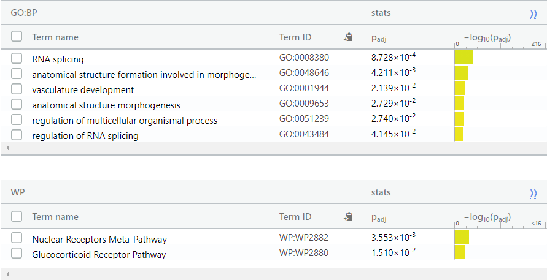
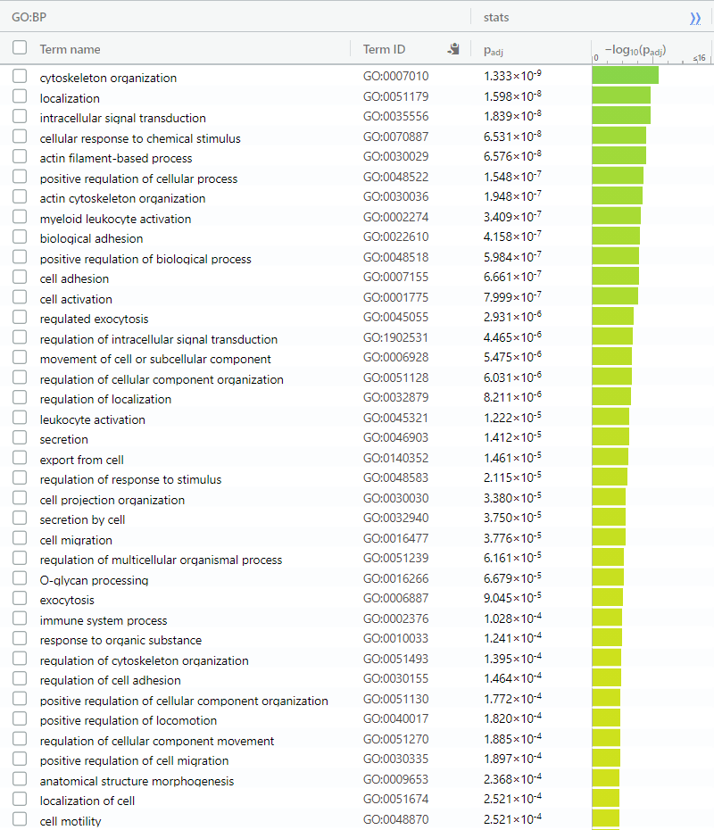
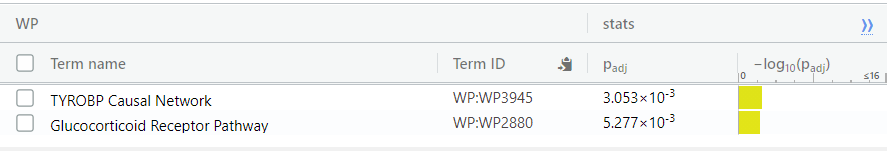
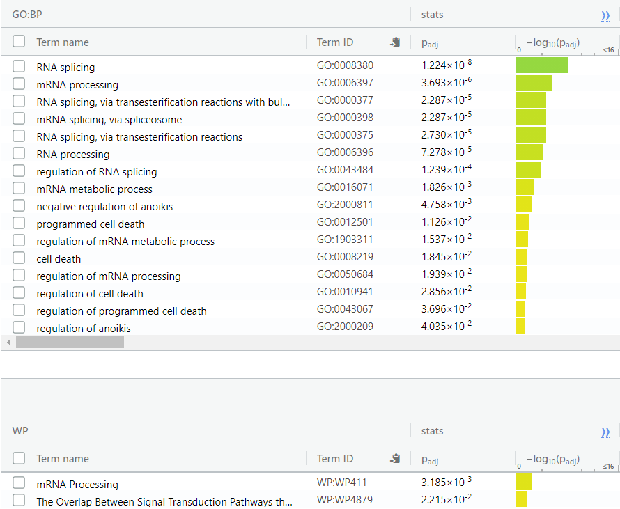
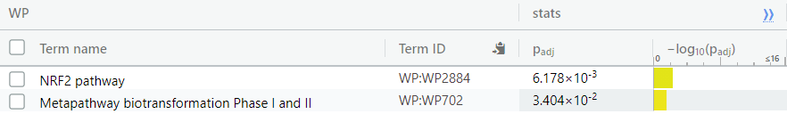
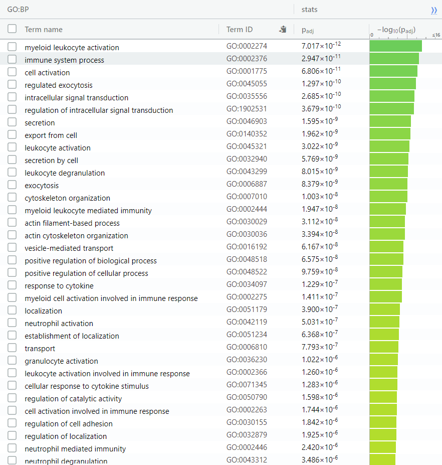
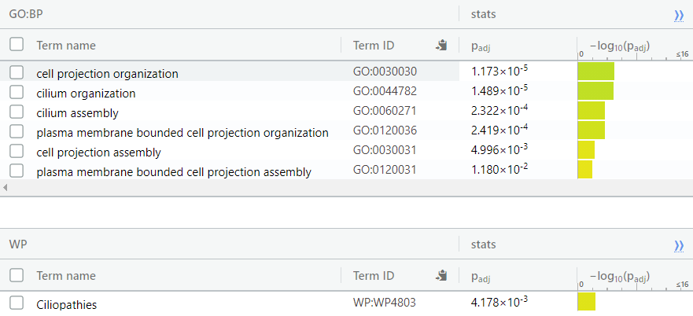

# Introduction

The following data-set contains the RNA-Seq data of 67 patients who are either
suffering a degree of asthma, or are not suffering from asthma. This data was 
collected in order to determine the link between the severity of their asthma and 
their risk to Covid-19.

With both SARS-Cov-2 and asthma being respiratory diseases there have been questions
as to whether asthma would increase an individual's disposition to contracting the disease. 
The primary method the authors in this study use in order to investigate this is by 
analyzing the expression levels of ACE2, the primary receptor involved in infection of SARS-Cov-2, in individuals with varying degrees of asthma.

This data is found under the GEO Accession Series Number of: GSE158752 [3]. 

```{r, message=FALSE}
if (!file.exists("GSE158752_IMSA_BEC-RAW_Counts.txt")) {
  GEOquery::getGEOSuppFiles("GSE158752",makeDirectory = FALSE)
  R.utils::gunzip("GSE158752_IMSA_BEC-RAW_Counts.txt.gz")
}
rawCounts = read.table("GSE158752_IMSA_BEC-RAW_Counts.txt",header=TRUE, 
                       row.names = 1, check.names = FALSE)
summarizedGeneCounts <- sort(table(rownames(rawCounts)),decreasing = TRUE)
```

## Sample Size
There are 67 samples within this experiment. 

The samples are split into three groups, the control group "Healthy" with no 
asthma, and two experimental groups with "Mild" Asthma and "Severe" Asthma. These 
are represented respectively by "H", "M", & "S".

```{r}
countHealthy = sum(unlist(lapply(colnames(rawCounts),grep,pattern="_H")))
countMild = sum(unlist(lapply(colnames(rawCounts),grep,pattern="_M")))
countSevere = sum(unlist(lapply(colnames(rawCounts),grep,pattern="_S")))
graphics::barplot(height=c(countHealthy,countMild,countSevere),
                  names.arg=c("Healthy","Mild","Severe"),
                  xlab="Asthma Type",
                  ylab="Number of Samples",
                  main="Count of Each Asthma Type in Data-set")

```
Out of the 67 samples, 17 samples are from healthy individuals, and 25 are from
individuals suffering from mild and severe asthma.

## Data and Normalization

```{r}
samples <- data.frame(lapply(colnames(rawCounts),
                      FUN=function(x){unlist(strsplit(x, split = "\\_"))[c(1,3)]}))
colnames(samples) <- colnames(rawCounts)
rownames(samples) <- c("Patient","Asthma_severity")
samples <- data.frame(t(samples))
cpms = edgeR::cpm(rawCounts)
keep = rowSums(cpms >1) >=67
countsFiltered = rawCounts[keep,]
filteredDataMatrix <- as.matrix(countsFiltered)
d = edgeR::DGEList(counts=filteredDataMatrix, group=samples$Asthma_severity)
d = edgeR::calcNormFactors(d)
TMMCounts = edgeR::cpm(d)
```

The data is available through the GEO Accession via the supplemental files. In this
notebook it is downloaded using the GEOQuery Package [2]. Data normalization is done via
the edgeR package using the TMM normalization method [4].

```{r}
genesBeforeNorm = nrow(rawCounts)
genesAfterNorm = nrow(countsFiltered)
graphics::barplot(height=c(genesBeforeNorm, genesAfterNorm),
                  names.arg=c("Before Normalization", "After Normalization"),
                  xlab="State of Analysis",
                  ylab="Number of Genes",
                  main="Number of Genes in Data-set Pre and Post-Normalization")

```

After normalizing gene counts and filtering out genes with less than 1 CPM per sample, 13369 
genes were filtered out, leaving 12865 genes out of the original 26234 genes.

# Differential Gene Expression Analysis

In this section Differential Gene Expression Analysis will be done on the normalized
data-set in order to rank the genes differentials expressed between the individuals with 
different severities of asthma.

## Calculating p-values

I choose to use the edgeR package here as my data was collected using RNA-Seq 
technology as opposed to microarray which would be more suited using the Limma package.

```{r}
limma::plotMDS(d, labels=rownames(samples),
        col = c("darkgreen","blue","red")[factor(samples$Asthma_severity)], main = "MDS Plot")
```

As the MDS shows the severity of asthma is an important factor as to determining 
gene expression in this data-set. While the severe cases are the most different, the mild cases and healthy cases also have their own clusters on the y-axis. As the severity of asthma is not a binary variable as it contains multiple states I choose to analyze this data-set treating the severity of asthma as 3 different states with Healthy being the negative control. 

I use the Quasi likelihood method as described in the edgeR vignette as it is not simply comparing 2 states and the data-set contains many samples.

```{r}
model <- model.matrix(~ samples$Asthma_severity)
d <- edgeR::estimateDisp(d, model)
fit <- edgeR::glmQLFit(d, model)
qlf <- edgeR::glmQLFTest(fit, coef = 2:3)
qlf_output_hits <- edgeR::topTags(qlf,sort.by = "PValue",
 n = nrow(filteredDataMatrix))
```

```{r}
length(which(qlf_output_hits$table$PValue < 0.05))
```
5220 genes were found to be significant in this analysis. 


## Multiple Hypothesis Testing

```{r}
length(which(qlf_output_hits$table$FDR < 0.05))
```
I use FDR, or False Discovery Rate as a correction here. It is not as stringent
as a bonferonni correction which would filter out a majority of the genes found to
be significant. After correction 3644 genes are found to be significant.

## Genes of Interest

```{r}
volcanoData <- cbind(qlf_output_hits$table$logFC.samples.Asthma_severityS, -log10(qlf_output_hits$table$FDR))
colnames(volcanoData) <- c("log (Fold Change)", "-log (FDR Q-Value)")
DEGs <- qlf_output_hits$table$FDR < 0.05 
point.col <- ifelse(DEGs, "red", "blue")
plot(volcanoData, pch = 16, col = point.col, cex = 0.5, main = "-log(FDR Q-Value) vs log(Fold Change) in Severe Asthma")
legend(x = 2,y = 2,col = c("red","blue"),legend = c("DEG", "Non-DEG"), pch = 16)
#Getting ACE2 Coordinates
ACE2X = qlf_output_hits["ACE2",]$table$logFC.samples.Asthma_severityS
ACE2Y = -log10(qlf_output_hits["ACE2",]$table$FDR)
text(ACE2X,ACE2Y,"ACE2")
```

## Heatmap
```{r}
normData <- log2(TMMCounts)
top_hits <- rownames(qlf_output_hits$table)[qlf_output_hits$table$FDR <0.05]
heatmap_matrix_tophits <- t(
  scale(t(normData[which(rownames(normData)
        %in% top_hits),])))
if(min(heatmap_matrix_tophits) == 0){
  heatmap_col = circlize::colorRamp2(c( 0, max(heatmap_matrix_tophits)),
                          c( "white", "red"))
  } else {
  heatmap_col = circlize::colorRamp2(c(min(heatmap_matrix_tophits), 0,
                          max(heatmap_matrix_tophits)),
                          c("blue", "white", "red"))
  }

current_heatmap <- ComplexHeatmap::Heatmap(as.matrix(heatmap_matrix_tophits),
cluster_rows = TRUE,
cluster_columns = TRUE,
show_row_dend = TRUE,
show_column_dend = TRUE,
col=heatmap_col,
show_column_names = TRUE,
show_row_names = FALSE,
show_heatmap_legend = TRUE,
use_raster = TRUE,
column_names_gp = grid::gpar(fontsize = 4),
column_title = "Patient Type",
row_title = "Gene",
heatmap_legend_param = list(title = "Normalized Gene Expression")
)
ComplexHeatmap::draw(current_heatmap)
```

The severe cases of asthma tend to cluster together, with a majority of them clustering
together on the left side of the heatmap. The healthy and mild samples tended to be closer 
together than with severe. The major difference between the severe cluster and 
the rest of the cluster is the the large upregulation of genes in the bottom half of the
heatmap.

# Thresholded Over-Representation Analysis

## Up and Down Regulation Together Analysis


### Choice of Analysis Method

I decided on using the thresholded list analysis method. Based on my heatmap  there
are clear clusters of differing gene expression
which show differences between the control and severe asthma as well 
as the mild asthma and severe/healthy asthma cases.

I decided on using g:profiler [8] using the annotation dataset of GO: Biological Process.
The paper from which the dataset originates uses GO annotation as well, however
I find the molecular function and location GO annoations to be irrelevant to this study.
In addition to GO, I will be using Wikipathways as it contains more specific pathways related
to asthma.

### Mild Asthma

```{r eval = FALSE} 
mild <- rownames(qlf_output_hits$table)[qlf_output_hits$table$PValue < 0.05 & qlf_output_hits$table$logFC.samples.Asthma_severityM > 0.3 | qlf_output_hits$table$logFC.samples.Asthma_severityM < -0.3]
fileConn <- file("mildDEG.txt")
writeLines(mild,fileConn)
```



6 genesets were returned from the GO:Biological Process set and 2 geneset was
returned from the Wiki Pathways set. These were both done using a p-value threshold 
of 0.05 and a fold change cutoff of 2 up and down.

### Severe Asthma

```{r eval = FALSE} 
severe <- rownames(qlf_output_hits$table)[qlf_output_hits$table$PValue <0.05 & qlf_output_hits$table$logFC.samples.Asthma_severityS > 0.3 |
qlf_output_hits$table$logFC.samples.Asthma_severityS < -0.3 ]
fileConn <- file("severeDEG.txt")
writeLines(severe,fileConn)
```





There are 125 genesets returned from the GO:Biological Process and 2 genesets
returned from the Wiki Pathways. This was also done using 0.05 p-value cutoff
and fold change cutoff of 2 up and down.

## Up and Down Regulation Seperately Analysis

### Mild Asthma

```{r eval = FALSE} 
mildUpregulated <- rownames(qlf_output_hits$table)[qlf_output_hits$table$PValue <0.05 & 
                            qlf_output_hits$table$logFC.samples.Asthma_severityM > 0.3]
fileConn <- file("mildUpregulated.txt")
writeLines(mildUpregulated,fileConn)
mildDownregulated <- rownames(qlf_output_hits$table)[qlf_output_hits$table$PValue <0.05 & 
                            qlf_output_hits$table$logFC.samples.Asthma_severityM < -0.3]
fileConn <- file("mildDownregulated.txt")
writeLines(mildDownregulated,fileConn)
```






There are more genesets found in the GO:Biological Process in upregulated when compared to
when both upregulated and downregulated were combined. In addition downregulated genes did
not yield any GO results and has two new Wiki Pathways genesets.


### Severe Asthma
```{r eval = FALSE} 
severeUpregulated <- rownames(qlf_output_hits$table)[qlf_output_hits$table$PValue <0.05 & 
                            qlf_output_hits$table$logFC.samples.Asthma_severityS > 0.3]
fileConn <- file("severeUpregulated.txt")
writeLines(severeUpregulated,fileConn)
severeDownregulated <- rownames(qlf_output_hits$table)[qlf_output_hits$table$PValue <0.05 & 
                            qlf_output_hits$table$logFC.samples.Asthma_severityS < -0.3]
fileConn <- file("severeDownregulated.txt")
writeLines(severeDownregulated,fileConn)
```






The upregulated geneset contains a similar amount of genesets for GO as the dataset containing
upregulation and downregulation. The downregulation returned a smaller amount of genesets with a particular focus on cilium.

# Interpretation

## Relation to Paper

Similarly to the paper, this analysis found evidence of upregulation of genes that would
predispose individuals to more severe symptoms of Covid-19. This aligns
with the paper's conclusion of there being increased risk factors for asthma patients
who are infected by Covid-19. 

Particularly in the severe asthma category there was found to be an upregulation of the Glucocorticoid Receptor Pathway.
In mild asthma patients there were not found to be many upregulated genesets in accordance
to the paper as well.

Something the paper did not find was a correlation between the Severe Asthma and the downregulation of ciliopathies.

## Supporting Evidence to Results

There has been evidence many respiratory viruses, including Covid-19 attach to the cilia 
in the body and damage them leading to easier infection by the virus [9] . The downregulation of such cilia based genes could be another reason as to why severe asthma leads to more extreme cases of Covid-19.

# References

1. R Core Team (2013). R: A language and environment for statistical
  computing. R Foundation for Statistical Computing, Vienna, Austria.
  URL http://www.R-project.org/.
  
2. Davis, S. and Meltzer, P. S. GEOquery: a bridge between the Gene Expression Omnibus
  (GEO) and BioConductor. Bioinformatics, 2007, 14, 1846-1847
  
3. Camiolo, M., Gauthier, M., Kaminski, N., Ray, A., &amp; Wenzel, S. E. (2020). Expression of    sars-cov-2 receptor ace2 and coincident host response signature varies by asthma inflammatory     phenotype. Journal of Allergy and Clinical Immunology, 146(2).doi:10.1016/j.jaci.2020.05.051

4. Robinson MD, McCarthy DJ and Smyth GK (2010). edgeR: a Bioconductor package for
  differential expression analysis of digital gene expression data. Bioinformatics 26,
  139-140
  
5. Henrik Bengtsson (2020). R.utils: Various Programming Utilities. R package version
  2.10.1. https://CRAN.R-project.org/package=R.utils
  
6. Ritchie, M.E., Phipson, B., Wu, D., Hu, Y., Law, C.W., Shi, W., and Smyth, G.K. (2015).
  limma powers differential expression analyses for RNA-sequencing and microarray
  studies. Nucleic Acids Research 43(7), e47.

7. Gu, Z. (2016) Complex heatmaps reveal patterns and correlations in multidimensional
  genomic data. Bioinformatics.
  
8. Uku Raudvere, Liis Kolberg, Ivan Kuzmin, Tambet Arak, Priit Adler, Hedi Peterson, Jaak Vilo:     g:Profiler: a web server for functional enrichment analysis and conversions of gene lists     (2019 update) Nucleic Acids Research 2019; doi:10.1093/nar/gkz369 [PDF].

9. Li, W., Li, M., &amp; Ou, G. (2020). COVID‐19, cilia, and smell. The FEBS Journal, 287(17),    3672-3676. doi:10.1111/febs.15491


