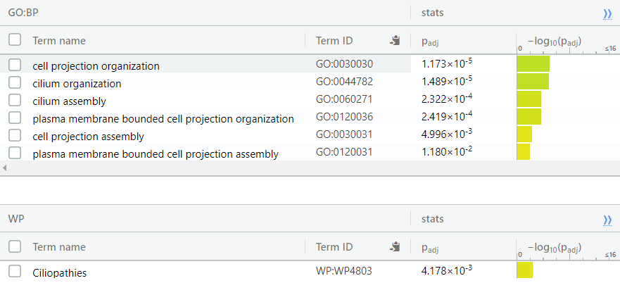

```{r, message=FALSE}
if (!requireNamespace("VennDiagram", quietly = TRUE))
    install.packages("VennDiagram")
if (!requireNamespace("R.utils", quietly = TRUE))
    install.packages("R.utils")
```

# Introduction

The data used in this assignment contains the RNA-Seq data of 67 patients who
are suffering from a degree of asthma (Mild or Severe) or are healthy. The purpose of the data
is to investigate the relationship between severity of asthma and severity of Covid-19 symptoms.

Out of the 67 samples, 17 samples are from healthy individuals, and 25 are from
individuals suffering from mild and severe asthma.

This data is found under the GEO Accession Series Number of: GSE158752. [3]

In this notebook I used the GEOQuery Package in order to download the data. [2]

```{r, message=FALSE}
if (!file.exists("GSE158752_IMSA_BEC-RAW_Counts.txt")) {
  GEOquery::getGEOSuppFiles("GSE158752",makeDirectory = FALSE)
  gunzip("GSE158752_IMSA_BEC-RAW_Counts.txt.gz")
}
rawCounts = read.table("GSE158752_IMSA_BEC-RAW_Counts.txt",header=TRUE, 
                       row.names = 1, check.names = FALSE)
summarizedGeneCounts <- sort(table(rownames(rawCounts)),decreasing = TRUE)
```

## Data Normalization (Assignment 1)

Normalization of the data (done in assignment 1) was done using the TMM normalization
method in the edgeR package [4].


```{r}
samples <- data.frame(lapply(colnames(rawCounts),
                      FUN=function(x){unlist(strsplit(x, split = "\\_"))[c(1,3)]}))
colnames(samples) <- colnames(rawCounts)
rownames(samples) <- c("Patient","Asthma_severity")
samples <- data.frame(t(samples))
cpms = edgeR::cpm(rawCounts)
keep = rowSums(cpms >1) >=67
countsFiltered = rawCounts[keep,]
filteredDataMatrix <- as.matrix(countsFiltered)
d = edgeR::DGEList(counts=filteredDataMatrix, group=samples$Asthma_severity)
d = edgeR::calcNormFactors(d)
TMMCounts = edgeR::cpm(d)
genesBeforeNorm = nrow(rawCounts)
genesAfterNorm = nrow(countsFiltered)
graphics::barplot(height=c(genesBeforeNorm, genesAfterNorm),
                  names.arg=c("Before Normalization", "After Normalization"),
                  xlab="State of Analysis",
                  ylab="Number of Genes",
                  main="Number of Genes in Data-set Pre and Post-Normalization")

```

After normalizing gene counts and filtering out genes with less than 1 CPM per sample, 13369 
genes were filtered out, leaving 12865 genes out of the original 26234 genes.

## Differential Gene Expression Analysis (Assignment 2)


Differential Gene Expression Analysis was done using the Quasi likelihood method in 
edgeR [4]. The model chosen treats mild and severe Asthma cases as different states
with healthy patients being a control case.

```{r}
model <- model.matrix(~ samples$Asthma_severity)
d <- edgeR::estimateDisp(d, model)
fit <- edgeR::glmQLFit(d, model)
qlf <- edgeR::glmQLFTest(fit, coef = 2:3)
qlf_output_hits <- edgeR::topTags(qlf,sort.by = "PValue",
n = nrow(filteredDataMatrix))
length(which(qlf_output_hits$table$PValue < 0.05))
length(which(qlf_output_hits$table$FDR < 0.05))
```

After this analysis 5220 genes were found to be significant using a p-value 
cutoff of 0.05.

After a p-value correction using False Discovery Rate, 3644 genes were found to be
significant with a q-value cutoff of 0.05.

### Volcano Plot

```{r}
volcanoData <- cbind(qlf_output_hits$table$logFC.samples.Asthma_severityS, -log10(qlf_output_hits$table$FDR))
colnames(volcanoData) <- c("log (Fold Change)", "-log (FDR Q-Value)")
DEGs <- qlf_output_hits$table$FDR < 0.05 
point.col <- ifelse(DEGs, "red", "blue")
plot(volcanoData, pch = 16, col = point.col, cex = 0.5, main = "-log(FDR Q-Value) vs log(Fold Change) in Severe Asthma")
legend(x = 2,y = 2,col = c("red","blue"),legend = c("DEG", "Non-DEG"), pch = 16)
```

### Heatmap

```{r}
normData <- log2(TMMCounts)
top_hits <- rownames(qlf_output_hits$table)[qlf_output_hits$table$FDR <0.05]
heatmap_matrix_tophits <- t(
  scale(t(normData[which(rownames(normData)
        %in% top_hits),])))
if(min(heatmap_matrix_tophits) == 0){
  heatmap_col = circlize::colorRamp2(c( 0, max(heatmap_matrix_tophits)),
                          c( "white", "red"))
  } else {
  heatmap_col = circlize::colorRamp2(c(min(heatmap_matrix_tophits), 0,
                          max(heatmap_matrix_tophits)),
                          c("blue", "white", "red"))
  }

current_heatmap <- ComplexHeatmap::Heatmap(as.matrix(heatmap_matrix_tophits),
cluster_rows = TRUE,
cluster_columns = TRUE,
show_row_dend = TRUE,
show_column_dend = TRUE,
col=heatmap_col,
show_column_names = TRUE,
show_row_names = FALSE,
show_heatmap_legend = TRUE,
use_raster = TRUE,
column_names_gp = grid::gpar(fontsize = 4),
column_title = "Patient Type",
row_title = "Gene",
heatmap_legend_param = list(title = "Normalized Gene Expression")
)
ComplexHeatmap::draw(current_heatmap)
```


## Thresholded Gene Analysis (Assignment 2)

Thresholded Gene Analysis was done using g:profiler [6]. The thresholds used
were a p-value cutoff of 0.05 and a fold change up or down of greater than 2.

Highlights of the analysis include confirming the study's results of finding
the Glucocorticoid Receptor Pathway was significantly enriched as well as finding
the enrichment of Ciliopathies Pathway which is theorized to be linked to Covid-19 severity.




# Non-Thresholded Gene Set Analysis

## Choice and explanation of method

A non-thresholded gene analysis will be done using GSEA 4.1.0 [7]. I will be using GSEA
pre-ranked analysis. GSEA is chosen here do to ease of access and use, along with 
the ability to easily change parameters.

I will be using a min gene-set size of 15 and a max size of 200. This is in order to 
filter out genesets that are too generic for this purpose. I will be using 100 gene permutations.

In order to perform a GSEA analysis, a gmt file is needed. I will be using the 
one created by the Bader Lab as seen in lecture.
I believe this is the best choice as the pathways used in lecture will
include the ones I used for the thresholded analysis.

The code below adapted from lecture. It is used in order to grab the latest gmt file release
from the Bader Lab site.

```{r, , message=FALSE}
gmt_url = "http://download.baderlab.org/EM_Genesets/current_release/Human/symbol/"
# list all the files on the server
filenames =RCurl::getURL(gmt_url)
tc = textConnection(filenames)
contents = readLines(tc)
close(tc)
# get the gmt that has all the pathways and does not include terms inferred from
# electronic annotations(IEA) start with gmt file that has pathways only
rx = gregexpr("(?<=<a href=\")(.*.GOBP_AllPathways_no_GO_iea.*.)(.gmt)(?=\">)", contents, 
              perl = TRUE)
gmt_file = unlist(regmatches(contents, rx))
dest_gmt_file <- file.path(getwd(),gmt_file)
download.file(paste(gmt_url, gmt_file, sep = ""), destfile = dest_gmt_file)
```

```{r, message=FALSE}
tmpQLFOutput <- qlf_output_hits$table
tmpQLFOutput$rank <- -log(tmpQLFOutput$PValue) *   sign(tmpQLFOutput$logFC.samples.Asthma_severityS)
tmpQLFOutput = tmpQLFOutput[order(tmpQLFOutput$rank, decreasing=TRUE),] 
severeRank = cbind(data.frame(rownames(tmpQLFOutput)), data.frame(tmpQLFOutput$rank))
write.table(x=severeRank, file="SevereRank.rnk", sep = "\t", row.names = FALSE, col.names = FALSE, quote = FALSE)
```

Rank files are created using the P-value and log Fold Change of the samples.

## Summary of Results


There are 7 genes which were found to be signficiant in the upregulated set with a cutoff
of 0.05 FDR Q-value. 

The top geneset in this set is Nucleotide-Sugar Biosynthic Process from GO: Biological Process.
It has a p-value of 0.0, ES of 0.82, NES of 2.16, FDR of 0.0, and 5 genes in the leading edge.

These genesets do not seem to share an obvious pattern.


There are 18 genes which were found to be signficiant in the downregulated set with a cutoff
of 0.05 FDR Q-value. 

The top geneset in this set is Ciliopathies from Wiki Pathways. It has a p-value of 0.0,
ES of -0.55, NES of -2.27, FDR of 0.010, and 64 genes in the leading edge.

Many of these genesets involve Cilium and Peroxisome pathways.

## Comparison to the Thresholded Gene Analysis

For the downregulation set, the results seem to correlate, many of the genesets found to be significant in the GSEA Analysis involved Cilium which was also found in the g:profiler analysis. There are many other genesets found in the GSEA analysis that were not found in 
g:profiler, many of them involving peroxisome.

For the upregulation set, the TYROBP Casual Network is found in both, however many other genesets were found in the GSEA analysis.

This comparison is more complex than it appears on the surface, the GSEA Analysis uses many more parameters for significance testing than when compared with the g:profiler analysis. While g:profiler only uses p-value, GSEA uses many corrected forms of p-value. When only using p-value many of the genesets that appear in the GSEA Analysis would not be statistically significant either.

# Visualization of Geneset Enrichment Analysis

## Automatically Generated Enrichment Map

I created the following enrichment maps via the Enrichment Map App [9] in Cytoscape [8].
The thresholds of 0.05 q-value and 0.375 Edge Cutoff were used.


The resulting map contains 22 nodes and 13 edges.


## Map Annotation

I used a FDR Q-value cutoff of 0.05 and default parameters otherwise.


## Publication Ready Figure


## Theme Network

Once collapsed it becomes apparent the largest themes in the map are as follows: Cilium, Kidney,
Peroxisome, then Nucleotide-Sugar. As before Cilium fits with the analysis as presented before. The other 3 are more of a surprise as they did not appear apparent with the previous analysis.

# Interpretation

## Comparison to Paper

The paper mainly focused on the ACE2 Receptor a receptor for the Covid-19 virus. The authors theorize an increased expression of ACE2, which is scene in high severity asthma patients, will lead to more severe cases of Covid-19 [3].

While the ACE2 receptor was statistically significant in the DEG analysis, it does not appear in any of the significant genesets in the GSEA Analysis. There is evidence damaged cilium will lessen your defences against Covid-19 [10], this supports the authors hypothesis of severe asthma leading to more severe Covid-19 symptoms. In addition there are scientists researching the hypothesis that diseases similar to Covid-19 attack the peroxisome first when entering the body [11].

In comparison to the results from Assignment 2 there are more genesets which came out as significant in the analysis. Of these the largest sets are peroxisome, cilium, kidney, & nucleotide-sugar. Cilium appeared in both the g:profiler analysis along with the GSEA Analysis, however in the GSEA Analysis more cilium genesets were found statistically significant.

## Supporting Evidence

There is significant evidence asthma damages the ability for cilium to regenerate in sufferers [12]. The downregulation of cilium gene expression could be the explanation for weakening cilium regeneration. In addition there is evidence asthma leads to increased risk of chronic kidney disease [13].

## Dark Matter Analysis

I will be performing dark matter analysis which will look at the blind spots of the 
previous analyses. 

The following code is adapted from lecture 12 with directories and names changed around.

```{r}
library(GSA)
gmt_file <- file.path(getwd(),"data", "Human_GOBP_AllPathways_no_GO_iea_March_01_2021_symbol.gmt")
capture.output(genesets<- GSA.read.gmt(gmt_file),file="gsa_load.out")
names(genesets$genesets) <- genesets$geneset.names
expression <- filteredDataMatrix
rank <- severeRank
```

```{r}
#get all the GSEA directories
gsea_directories <- list.files(path = file.path(getwd(),"data"),
 pattern = "\\.GseaPreranked")
if(length(gsea_directories) == 1){
 gsea_dir <- file.path(getwd(),"data",gsea_directories[1])
 #get the gsea result files
 gsea_results_files <- list.files(path = gsea_dir,
 pattern = "gsea_report_*.*.tsv")
 #there should be 2 gsea results files
 enr_file1 <- read.table(file.path(gsea_dir,gsea_results_files[1]),
 header = TRUE, sep = "\t", quote="\"",
 stringsAsFactors = FALSE,row.names=1)
 enr_file2 <- read.table(file.path(gsea_dir,gsea_results_files[1]),
 header = TRUE, sep = "\t", quote="\"",
 stringsAsFactors = FALSE,row.names=1)
}

#get the genes from the set of enriched pathwasy (no matter what thre
all_enr_genesets<- c(rownames(enr_file1), rownames(enr_file2))
genes_enr_gs <- c()
for(i in 1:length(all_enr_genesets)){
 current_geneset <- unlist(genesets$genesets[which(genesets$geneset.names %in% all_enr_genesets[1])])
 genes_enr_gs <- union(genes_enr_gs, current_geneset)
}

FDRThreshold <- 0.01
#get the genes from the set of enriched pathways (no matter what threshold)
allSigEnrGenesets<- c(rownames(enr_file1)[which(enr_file1[,"FDR.q.val"]<=FDRThreshold)], rownames(enr_file2)[which(enr_file2[,"FDR.q.val"]<=FDRThreshold)])
genesSigEnrGs <- c()
for(i in 1:length(allSigEnrGenesets)){
  current_geneset <- unlist(genesets$genesets[which(genesets$geneset.names %in% allSigEnrGenesets[i])]) 
  genesSigEnrGs <- union(genesSigEnrGs, current_geneset)
}

genes_all_gs <- unique(unlist(genesets$genesets))
```

### Venn Diagram

The venn diagram is created using the Venn Diagram package in R [14].

```{r, message=FALSE}
library("VennDiagram")
A <- genes_all_gs
B <- genesSigEnrGs
C <- rownames(qlf_output_hits$table)[qlf_output_hits$table$FDR <0.05]
png(file.path(getwd(),"figures/darkMatterOverlaps.png"))
venn.plot<- draw.triple.venn(
    area1=length(A), 
    area2=length(B), 
    area3 = length(C),
    n12 = length(intersect(A,B)),
    n13=length(intersect(A, C)), 
    n23 = length(intersect(B,C)),
    n123 = length(intersect(A,intersect(B,C))), 
    category = c("all genesets", "all enrichment results", "expression"),
    fill = c("red","green","blue"),
    cat.col = c("red","green","blue")
  )
grid.draw(venn.plot)
dev.off()
```


A large portion of the genes which were found to be significant via p-value were not
present at all in the genesets.

### Top Genes not Found in Pathways
```{r}
length(genes_all_gs)
length(genesSigEnrGs)
```

```{r}
genes_no_annotation <- setdiff(rownames(qlf_output_hits$table)[qlf_output_hits$table$FDR <0.05], genes_all_gs)
ranked_gene_no_annotation <- rank[which(rank[,1] %in% genes_no_annotation),]
ranked_gene_no_annotation[1:10,]

```

The top gene that did was not annotated in the pathways used in the gmt file is LRRC31.
This gene is Leucine Rich Repeat Containing 31, I could not find any source directly linking LRRC31 to either Covid-19 or Asthma.


```{r}
normData <- log2(TMMCounts)
top_hits <- ranked_gene_no_annotation$rownames.tmpQLFOutput.
heatmap_matrix_tophits <- t(
  scale(t(normData[which(rownames(normData)
        %in% top_hits),])))
if(min(heatmap_matrix_tophits) == 0){
  heatmap_col = circlize::colorRamp2(c( 0, max(heatmap_matrix_tophits)),
                          c( "white", "red"))
  } else {
  heatmap_col = circlize::colorRamp2(c(min(heatmap_matrix_tophits), 0,
                          max(heatmap_matrix_tophits)),
                          c("blue", "white", "red"))
  }

current_heatmap <- ComplexHeatmap::Heatmap(as.matrix(heatmap_matrix_tophits),
cluster_rows = TRUE,
cluster_columns = TRUE,
show_row_dend = TRUE,
show_column_dend = TRUE,
col=heatmap_col,
show_column_names = TRUE,
show_row_names = FALSE,
show_heatmap_legend = TRUE,
use_raster = TRUE,
column_names_gp = grid::gpar(fontsize = 4),
column_title = "Patient Type",
row_title = "Gene",
heatmap_legend_param = list(title = "Normalized Gene Expression")
)
ComplexHeatmap::draw(current_heatmap, column_title = "Normalized Gene Expression of Genes not found to be Annotated",column_title_gp = grid::gpar(fontsize = 12))
```

This heatmap retains the trend of grouping the healthy patients together in a cluster. A novel cluster which is seen in this heatmap and not the one done on all genes found significant via expression is found on the right side of the heatmap. This cluster of severe Asthma patients exhibit much more extreme upregulation and downregulation of all genes in this set when compared to all other patients in the study, even other severe asthma patients.


### Top Genes not Found to be Enriched in Pathways

```{r}
genes_no_enriched <- setdiff(rownames(qlf_output_hits$table)[qlf_output_hits$table$FDR <0.05], genesSigEnrGs)
ranked_gene_no_enriched <- rank[which(rank[,1] %in% genes_no_enriched),]
ranked_gene_no_enriched[1:10,]

```

The top 10 ranked genes in the overall set are still the top 10 genes in this set. This is due to a very small set of genes being found significantly enriched in this study (around 300). Many of these genes fit into more general categories which were too large to fit within our set limitation of max size 200.


```{r}
normData <- log2(TMMCounts)
top_hits <- ranked_gene_no_enriched$rownames.tmpQLFOutput.
heatmap_matrix_tophits <- t(
  scale(t(normData[which(rownames(normData)
        %in% top_hits),])))
if(min(heatmap_matrix_tophits) == 0){
  heatmap_col = circlize::colorRamp2(c( 0, max(heatmap_matrix_tophits)),
                          c( "white", "red"))
  } else {
  heatmap_col = circlize::colorRamp2(c(min(heatmap_matrix_tophits), 0,
                          max(heatmap_matrix_tophits)),
                          c("blue", "white", "red"))
  }

current_heatmap <- ComplexHeatmap::Heatmap(as.matrix(heatmap_matrix_tophits),
cluster_rows = TRUE,
cluster_columns = TRUE,
show_row_dend = TRUE,
show_column_dend = TRUE,
col=heatmap_col,
show_column_names = TRUE,
show_row_names = FALSE,
show_heatmap_legend = TRUE,
use_raster = TRUE,
column_names_gp = grid::gpar(fontsize = 4),
column_title = "Patient Type",
row_title = "Gene",
heatmap_legend_param = list(title = "Normalized Gene Expression")
)
ComplexHeatmap::draw(current_heatmap, column_title = "Normalized Gene Expression Not Found To Be Enriched",column_title_gp = grid::gpar(fontsize = 12))
```

This heatmap is almost identical to the heatmap made in assignment 2 containing all genes found significant via expression.

# References

1. R Core Team (2013). R: A language and environment for statistical
  computing. R Foundation for Statistical Computing, Vienna, Austria.
  URL http://www.R-project.org/.
  
2. Davis, S. and Meltzer, P. S. GEOquery: a bridge between the Gene Expression Omnibus
  (GEO) and BioConductor. Bioinformatics, 2007, 14, 1846-1847
  
3. Camiolo, M., Gauthier, M., Kaminski, N., Ray, A., &amp; Wenzel, S. E. (2020). Expression of    sars-cov-2 receptor ace2 and coincident host response signature varies by asthma inflammatory     phenotype. Journal of Allergy and Clinical Immunology, 146(2).doi:10.1016/j.jaci.2020.05.051

4. Robinson MD, McCarthy DJ and Smyth GK (2010). edgeR: a Bioconductor package for
  differential expression analysis of digital gene expression data. Bioinformatics 26,
  139-140
  
5. Henrik Bengtsson (2020). R.utils: Various Programming Utilities. R package version
  2.10.1. https://CRAN.R-project.org/package=R.utils
  
6. Uku Raudvere, Liis Kolberg, Ivan Kuzmin, Tambet Arak, Priit Adler, Hedi Peterson, Jaak Vilo:     g:Profiler: a web server for functional enrichment analysis and conversions of gene lists     (2019 update) Nucleic Acids Research 2019; doi:10.1093/nar/gkz369 [PDF].

7. Subramanian, A., Tamayo, P., Mootha, V. K., Mukherjee, S., Ebert, B. L., Gillette, M. A.,       Paulovich, A., Pomeroy, S. L., Golub, T. R., Lander, E. S., & Mesirov, J. P. (2005). Gene set    enrichment analysis: a knowledge-based approach for interpreting genome-wide expression         profiles. Proceedings of the National Academy of Sciences of the United States of America,      102(43), 15545–15550. https://doi.org/10.1073/pnas.0506580102

8. Shannon, P., Markiel, A., Ozier, O., Baliga, N. S., Wang, J. T., Ramage, D., Amin, N.,          Schwikowski, B., & Ideker, T. (2003). Cytoscape: a software environment for integrated models    of biomolecular interaction networks. Genome research, 13(11), 2498–2504.         
   https://doi.org/10.1101/gr.1239303

9. Merico, D., Isserlin, R., Stueker, O., Emili, A., & Bader, G. D. (2010). Enrichment map: a 
  network-based method for gene-set enrichment visualization and interpretation. PloS one,
  5(11), e13984. https://doi.org/10.1371/journal.pone.0013984
  
10. Lund Håheim L. (2020). Epithelial cilia is the first line of defence against Coronavirus; 
    addressing the observed age-gradient in the COVID-19 infection. Medical hypotheses, 143, 
    110064. https://doi.org/10.1016/j.mehy.2020.110064
    
11. The HIV-1 Accessory Protein Vpu Downregulates Peroxisome Biogenesis
    Zaikun Xu, Robert Lodge, Christopher Power, Eric A. Cohen, Tom C. Hobman
    mBio Mar 2020, 11 (2) e03395-19; DOI: 10.1128/mBio.03395-19
    
12. Li, W., Li, M., &amp; Ou, G. (2020). COVID‐19, cilia, and smell. The FEBS Journal, 287(17),     
    3672-3676. doi:10.1111/febs.15491

13. Huang, HL., Ho, SY., Li, CH. et al. Bronchial asthma is associated with increased risk of 
    chronic kidney disease. BMC Pulm Med 14, 80 (2014). https://doi.org/10.1186/1471-2466-14-80
    
14. Hanbo Chen (2018). VennDiagram: Generate High-Resolution Venn and Euler Plots. R
    package version 1.6.20.


